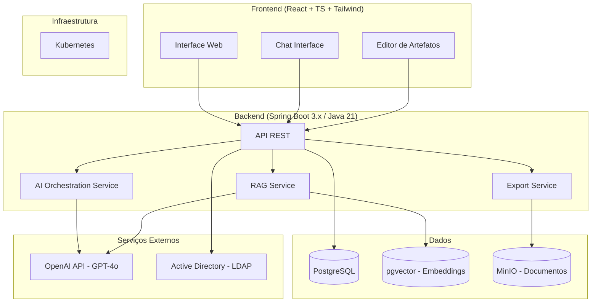

# Arquitetura do Sistema — AILER

## Visão Geral

O AILER é uma plataforma web corporativa que apoia todo o ciclo de descoberta, análise, especificação e planejamento de soluções tecnológicas para o TCE-CE. Utiliza IA Generativa, Busca Semântica e Base de Conhecimento Institucional para auxiliar analistas e gestores na construção de artefatos de requisitos padronizados e rastreáveis.

## Diagrama de Componentes



## Camadas e Responsabilidades (Backend)

| Camada | Responsabilidade | Pacote |
|--------|-----------------|--------|
| Controller | Endpoints REST, validação de input, autenticação | `br.gov.tce.ailer.<modulo>.controller` |
| Service | Lógica de negócio, orquestração de IA | `br.gov.tce.ailer.<modulo>.service` |
| Repository | Acesso a dados (JPA + pgvector) | `br.gov.tce.ailer.<modulo>.repository` |
| Domain | Entidades, value objects, enums | `br.gov.tce.ailer.<modulo>.domain` |
| DTO | Request/Response objects | `br.gov.tce.ailer.<modulo>.dto` |
| Config | Configurações Spring | `br.gov.tce.ailer.config` |
| AI | Clientes OpenAI, prompts, embeddings | `br.gov.tce.ailer.ai` |

## Estrutura de Módulos do Sistema

### Módulo 1 — Gestão de Demandas e Projetos
- **Responsabilidade**: CRUD de demandas, projetos, stakeholders, versões
- **Entrada**: Formulários do usuário
- **Saída**: Entidades persistidas com histórico de versões
- **Dependências**: Autenticação AD

### Módulo 2 — Entrevista Inteligente
- **Responsabilidade**: Assistente conversacional que conduz entrevistas guiadas
- **Entrada**: Contexto do projeto + respostas do usuário
- **Saída**: Registro estruturado do levantamento
- **Dependências**: OpenAI API, Módulo 1

### Módulo 3 — Canvas do Projeto
- **Responsabilidade**: Geração automática de canvas a partir do levantamento
- **Entrada**: Registro da entrevista
- **Saída**: Canvas completo (PDF/DOCX)
- **Dependências**: OpenAI API, Módulo 2, ExportService

### Módulo 4 — Especificação de Requisitos
- **Responsabilidade**: Geração de RF, RNF, RN, RI, RS
- **Entrada**: Canvas aprovado + contexto do projeto
- **Saída**: Documento de requisitos numerado e rastreável
- **Dependências**: OpenAI API, Módulos 2 e 3

### Módulo 5 — Histórias de Usuário e Backlog
- **Responsabilidade**: Geração de épicos, features, US e critérios de aceitação
- **Entrada**: Requisitos gerados
- **Saída**: Backlog exportável para GitLab/Jira/Taiga
- **Dependências**: OpenAI API, Módulo 4

### Módulo 13 — Base de Conhecimento Institucional (Fase 3)
- **Responsabilidade**: RAG com projetos anteriores do TCE-CE
- **Entrada**: Consultas semânticas
- **Saída**: Requisitos, regras e fluxos reutilizáveis
- **Dependências**: pgvector, OpenAI Embeddings API

## Fluxo Principal de Uso

```
1. Analista autentica via Active Directory
2. Cria nova demanda no Módulo 1
3. Inicia entrevista com o Módulo 2 (IA conduz perguntas)
4. Sistema gera Canvas automaticamente (Módulo 3)
5. Analista aprova/ajusta o Canvas
6. Sistema gera Requisitos (Módulo 4)
7. Sistema gera Histórias de Usuário (Módulo 5)
8. Exporta artefatos para DOCX/PDF ou GitLab
```

## Integrações Externas

| Serviço | Propósito | Tipo | Timeout |
|---------|-----------|------|---------|
| OpenAI API | LLM + Embeddings | REST/Streaming | 30s stream / 10s sync |
| Active Directory | Autenticação SSO | LDAP/OAuth2 | 5s |
| MinIO | Armazenamento de documentos | S3-compatible SDK | 30s |
| GitLab (Fase 2) | Exportação de backlog | REST API | 15s |

## Decisões Arquiteturais

Veja `context/decisions/` para os ADRs.

- [ADR-001](decisions/ADR-001-stack-tecnica.md): Stack tecnológica escolhida
- [ADR-002](decisions/ADR-002-ia-provider.md): Provedor de IA e modelo

## Requisitos Não Funcionais

- **Performance**: Respostas < 10s (exceto streaming de IA)
- **Disponibilidade**: 99% mínimo
- **Escalabilidade**: Horizontal via Kubernetes
- **Segurança**: RBAC + AD + auditoria completa
- **Conformidade**: LGPD, WCAG 2.1 AA

## Limites e Restrições Conhecidas

- Streaming de IA pode ultrapassar 30s para documentos longos — implementar timeout progressivo
- pgvector requer extensão habilitada no PostgreSQL — configurar via Flyway migration
- MinIO deve rodar no mesmo cluster Kubernetes
- Chamadas à OpenAI API têm custo — implementar cache de embeddings e rate limiting
